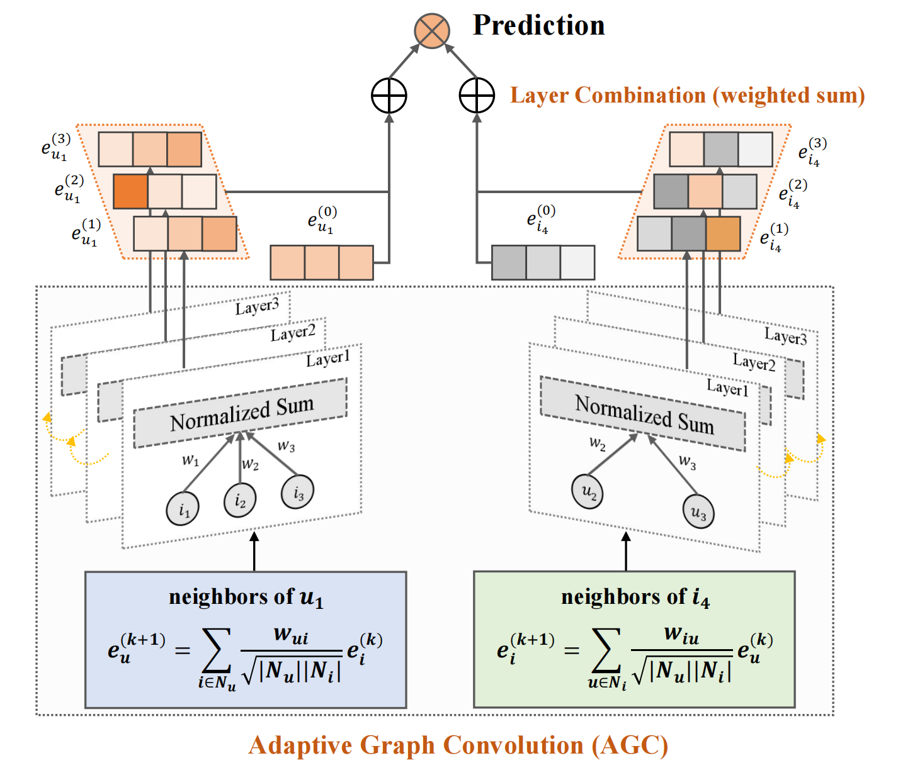
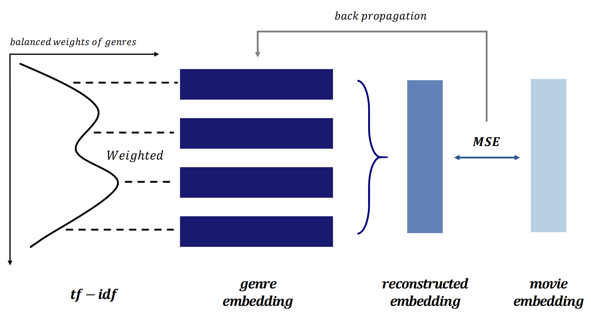

# Movie-Rec

## Description

This is a recommendation system for movies based on the ml-25m dataset. The system uses Graph Convolutional Networks (GCN) to recommend movies to users based on their ratings.  The model integrates **weighted interactions** and leverages user ratings to adjust neighborhood aggregation dynamically, enhancing the granularity with which user preferences are modeled. Additionally, the **Category Embedding Reconstruction (CatER)** submodule is implemented to further refine the representation of movies based on genre metadata, significantly improving the system’s performance in cold-start scenarios.

### 1. LightGCN

Our model is based on Light Graph Convolution Network (LightGCN). It addresses the limitations of NGCF by simplifying the GCN model, removing feature transformation matrices and nonlinear activation functions. It focuses purely on neighborhood aggregation, the key mechanism for collaborative filtering in graph-based models. This streamlined approach reduces computational complexity while preserving the core interaction dynamics, making LightGCN both efficient and interpretable.

### 2. Adaptive Graph Convolution Network

  

 

Building upon LightGCN, **AdaptiveGCN** introduces weighted user-movie interactions (Figure above), moving beyond uniform aggregation. By assigning interaction weights based on user ratings, AdaptiveGCN emphasizes significant relationships, refining user and item embeddings dynamically. Its propagation rule adapts LightGCN’s structure by integrating these weights:
$$
\begin{split}
e^{(k+1)}_u = \sum_{i \in N_u} \frac{w_{ui}}{\sqrt{|N_u||N_i|}} e^{(k)}_i & \\
e^{(k+1)}_i = \sum_{u \in N_i} \frac{w_{iu}}{\sqrt{|N_i||N_u|}} e^{(k)}_u &
\end{split}
$$

where $w_{ui}$ and $w_{iu}$ normalize interaction importance. By enhancing preference-aware modeling, AdaptiveGCN not only improves recommendation accuracy but also maintains efficiency, leveraging structural simplicity for more precise user-item predictions.

### 3. Category Embedding Reconstruction (CatER)

Graph Neural Networks (GNNs) excel in modeling user-item interactions but struggle with stability in sparse data, particularly during cold starts. To mitigate this, we introduce **Category Embedding Reconstruction (CatER)**, a submodel of AdaptiveGCN, which enhances item embeddings by integrating genre-based metadata. When little is known about a new movie, its title offers limited information, whereas its genre provides richer contextual cues. Similarly, for users with minimal watch history, genre data becomes crucial in guiding recommendations.

  

 

#### (1) Genre Weight Calculation

CatER assigns weights to each movie’s genres using a **TF-IDF-inspired** approach, adapted for genre relevance:

$$
w_{g} = \frac{\text{TF}_{g}}{\text{IDF}_{g}}
$$
where $w_g$ represents the weight of genre $g$, adjusted by term frequency $TF$ and inverse document frequency $IDF$. To prevent dominance by frequent genres, weights are normalized:

$$
\tilde{w}_{g} = \sqrt{\frac{w^{'}_{k}}{\sum_{k} w^{'}_{k}}}, \quad w^{'}_{k} = \sqrt{\frac{w_{k}}{\sum_{k} w_{k}}}
$$
ensuring a balanced contribution from each genre.

#### (2) Reconstruction of Genre-Based Embeddings

Using these weights, CatER reconstructs genre-enhanced embeddings via a weighted sum:

$$
e_{i} = \sum_{g \in G_i} \tilde{w}_{g} \cdot e_{g}
$$
where $e_i$ is the reconstructed embedding for movie $ i$, aggregated from pre-trained genre embeddings $e_g$. This approach embeds **genre-specific signals** into item representations, enhancing cold-start recommendations while preserving content-rich information.

By integrating genre-informed embeddings within the GNN framework, **CatER extends beyond simple category-based retrieval**, leveraging pre-trained embeddings to enrich recommendations even in sparse data scenarios. Ablation studies further demonstrate its effectiveness in improving prediction robustness.
